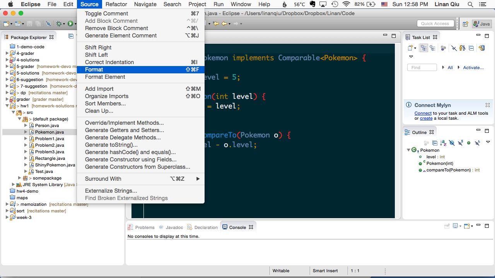
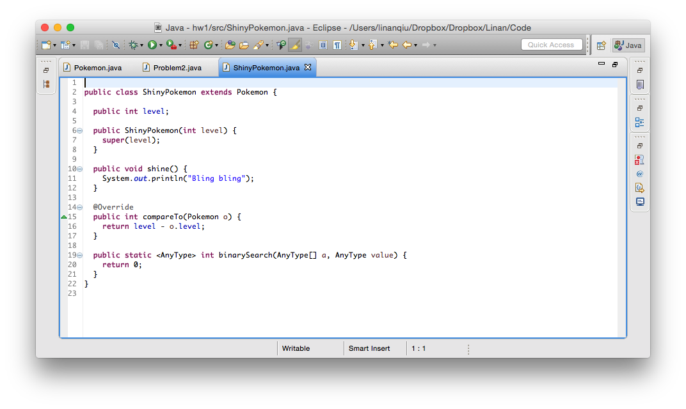
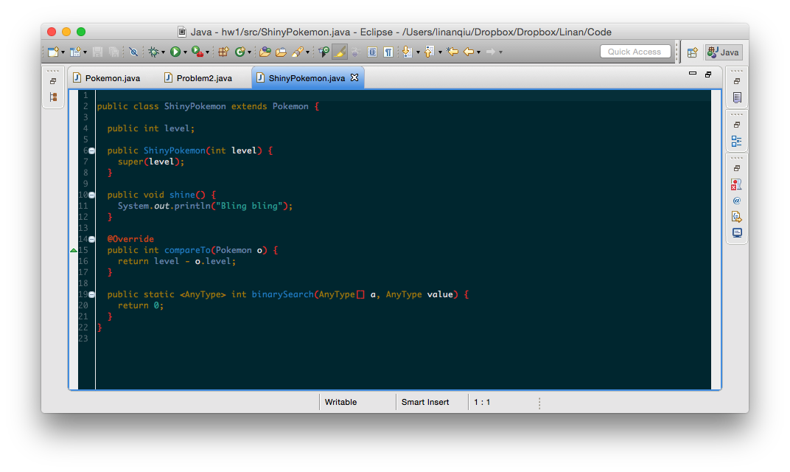
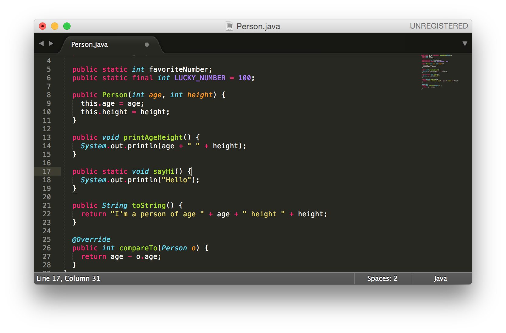
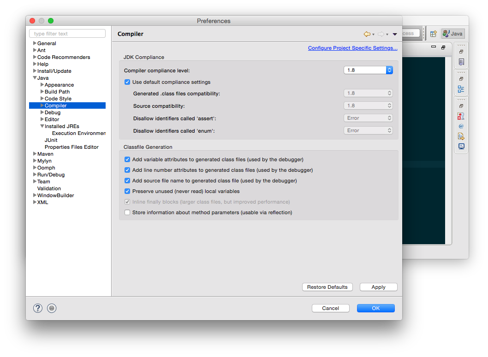
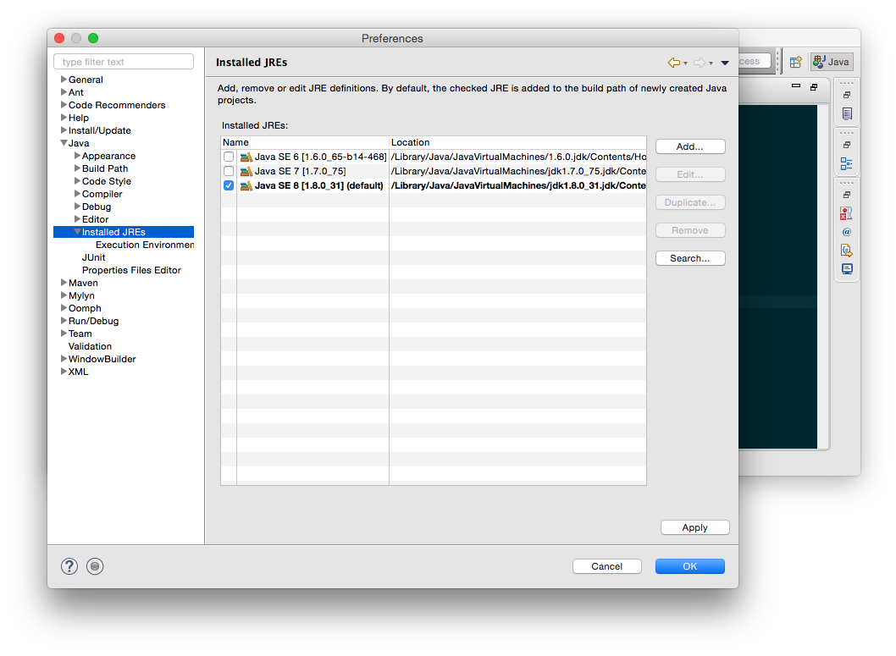

Prepared by Linan Qiu <[lq2137@columbia.edu](lq2137@columbia.edu)>

# Development Environment

Since [more than half the class uses Eclipse and a quarter uses Sublime](https://piazza.com/class/ijfyurrye2g1oc?cid=55), we thought that some development environment tips would be useful.

## Formatting Code

Formatting code automatically helps you make your code pretty in a second. If you have ever tried to manually indent your code (who doesn't remember the good ol' `nano` days of 1004) or spaced out your variables in a `for` loop, read this part carefully.

### Eclipse

In Eclipse, to format your entire source code, you can do this:

Or you can learn the shortcut. Macs `cmd + shift + f`. Windows `ctrl + shift + f`.

You can format just the highlighted portions of your code using the *Format Element* selection but that is really rarely used.

**Make it a habit to bang that key combination every few lines or so that you type**. It not only makes your code pretty, but also helps you detect errors easily: the format function won't work properly if you have syntax errors in your code, and seeing the code clearly allows you to detect logical mistakes easily.

### Sublime

If you're using Sublime 2 / 3, you should use [Sublime Package Control (packagecontrol.io)](https://packagecontrol.io/) to install packages. The installation instructions should be pretty clear from the site.

Then, install [SublimeAStyleFormatter (github.com/timonwong/SublimeAStyleFormatter)](https://github.com/timonwong/SublimeAStyleFormatter) that works for `C` `C++` `CUDA` `OpenCL` `C#` and `Java` files. The installation and usage instructions are pretty clear from the site.

## Colors

### Eclipse

For Eclipse, download the [Eclipse Color Theme (eclipsecolorthemes.org)](http://eclipsecolorthemes.org/) to prevent your eyes from being burned by the default white background of Eclipse. The instructions should be easy to follow.

### Sublime

Sublime's default color theme (Monokai) is great. It's fantastic actually. There's no compelling reason to change it unless you want your code to be the same color as your Eclipse code. In that case, Sublime has a Color Scheme picker built in and Solarized is prepackaged.

## Swtiching Java Editions

### Command Line

You probably have multiple versions of JDK install on your system. To specify which one to use during compilation, you should follow these instructions:

- Windows: [http://stackoverflow.com/questions/5492937/windows-ignores-java-home-how-to-set-jdk-as-default](http://stackoverflow.com/questions/5492937/windows-ignores-java-home-how-to-set-jdk-as-default)
- Mac: [http://stackoverflow.com/questions/21964709/how-to-set-or-change-the-default-java-jdk-version-on-os-x](http://stackoverflow.com/questions/21964709/how-to-set-or-change-the-default-java-jdk-version-on-os-x)

Or you could do what I just did: google *Switching JDK version Mac/Windows*

### Eclipse

In Eclipse, pointing Eclipse to the right JDK is easy peasy.

First you need to tell Eclipse to help you ensure that your code is compatible with the JDK you're choosing. For example, if you intend to write code for Java 1.6 (for god knows what reason), you need to tell Eclipse to not allow you to use new features in Java 1.7 (say the shortcut for `<>` in declaring generics) and mark those as errors for you.

For this class, you should set the compliance level at 1.8. There's no reason to go lower since we are grading your work using Java 1.8.

Then, more importantly, you need to tell Eclipse to run code using the right version of `java`. To do so, check if the right version of Java exists here:

If it does not appear here (e.g. you have installed Java 8, but Java 8 does not appear here). Then you'd need tou se the *Add* button to go to the directory where you installed Java and add Java manually. There are plenty of *Stackoverflow* answers for this, so please do google if you ever encounter this. It'd be a good learning experience (and an excuse for me to not make this too damn long).

As you become a more seasoned coder, you'll find ways to personalize your development environment. Then, you will learn to store (and migrate) your development environment (after all, you don't want to lose your precious settings when you move to a new computer / your new office). A well configured development environment can dramatically improve your productivity (and allow you to become a lazier coder). Remember: always do less work. Knowing your workshop well goes a long way.
