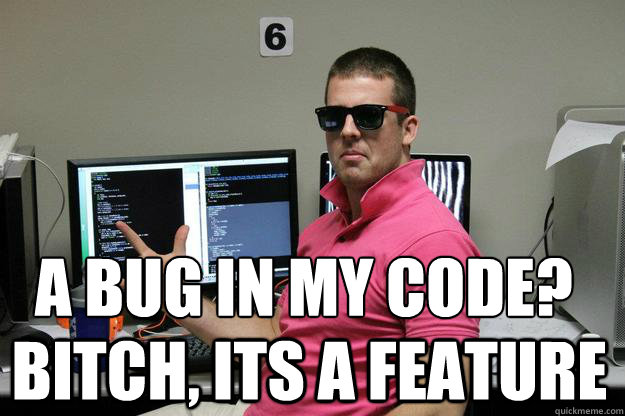

Prepared by Linan Qiu <[lq2137@columbia.edu](lq2137@columbia.edu)>

# Idioms

These will not be enforced very strictly, but they do make your code a lot more readable and saves you development time as well.

## Shorten If Else Statements

```java
public boolean flip() {
  boolean coinflip;

  if (Math.random() < 0.5) {
    coinflip = true;
  } else {
    coinflip = false;
  }

  return coinflip
}
```

can be written as

```java
public boolean flip() {
  return Math.random() < 0.5;
}
```

making the code more readable and succinct.

## Not comparing booleans with `true` or `false`

Let's say you're trying to implement a `findElement()` method on an array of **unsorted** elements. We can implement it as such:

```java
public static <T> int findElement(T[] array, value) {
  boolean found = false;
  int index = 0;

  for (int i = 0; i < array.length; i++) {
    if(array[i].equals(value)) {
      found = true;
      index = i;
    }
  }

  if (found == true) {
    return i;
  } else {
    return -1;
  }
}
```

Now if you ever see yourself typing `something == true` or `something == false`, you are doing something unnecessary. After all, `something` is itself a boolean and can be evaluated directly. In this case, we can shorten the last part of the block to:

```java
public static <T> int findElement(T[] array, value) {
  boolean found = false;
  int index = 0;

  for (int i = 0; i < array.length; i++) {
    if(array[i].equals(value)) {
      found = true;
      index = i;
    }
  }

  if (found) {
    return i;
  } else {
    return -1;
  }
}
```

## Ternary Statements

The last four lines in the `if` block still seems redundant. You can shorten it further using **ternary statements**, which are an alternative way of writing `if` or `else` loops *that return something*.

All `if` and `else` statements are essentially questions. A block like this:

```java
if (vader.isFatherTo(luke)) {
  return "I am your father";
} else {
  return "Oops wrong Jedi";
}
```

is asking the question *"Is vader luke's father? If yes, return the father string. Otherwise, return the Jedi string."* Note the placement of the question mark in this statement.

In ternary, this statement would be written

```java
return (vader.isFatherTo(luke) ? "I am your father" : "Oops wrong Jedi");
```

If you read this statement out (paying attention to the position of the question mark), it is literally saying: is `vader.isFatherTo(luke)` true? If so, whatever in the bracket is equal to `"I am your father"`. Otherwise, it is equal to `"Oops wrong Jedi"`.

This portion `(vader.isFatherTo(luke) ? "I am your father" : "Oops wrong Jedi")` actually returns you a value: that value depends on whether `vader.isFatherTo(luke)` returns `true` or `false`. That value, in turn, gets returned by the `return` keyword at the start. Hence, this shortens the entire block to just one line.

Similarly, we can modify our `findElement` method to use ternary:

```java
  boolean found = false;
  int index = 0;

  for (int i = 0; i < array.length; i++) {
    if(array[i].equals(value)) {
      found = true;
      index = i;
    }
  }

  return found ? index : -1;
}
```

This makes the code much more compact.

## Exiting a Loop Early using Return

This code is still badly written. Let's say the array contains 10 elements, and we managed to find the element we want at the second place. Do we really still need to keep looking through the rest of the array? We don't actually need to do that, but our code currently does. This can make quite a bit of difference in large arrays / linked lists. Let's improve on our code.

```java
  for (int i = 0; i < array.length; i++) {
    if(array[i].equals(value)) {
      return index;
    }
  }

  // only reach here if value is not found
  return -1;
}
```

Now, the code returns immediately when we find the element that is equals to value. Hence, the only way we can reach the `return -1` line is if no element matches value.

This can be applied to any kind of iteration that can be killed off early. Cool right?

## String Manipulation

This is one of the most common tasks ever. Almost 80% (untested statistic) of the work you do involves manipulating strings. Do this the wrong way and you'll be in lots of late nights.

```Java
public class Pikachu {

    private String name;
    private int level;
    private String[] moves;

    public Pikachu(String name, int level, String[] moves) {
        this.name = name;
        this.level = level;
    }

    // bad toString()
    public String toString() {
        String returnString = name + "\n";
        returnString = returnString + level + "\n";
        for(int i = 0 ; i < moves.length; i++) {
            returnString = returnString + moves[i] + "\n";
        }

        return returnString;
    }
}
```

What's wrong with this `toString()` method? Well, whenever you do something like this

```Java
String a = "hello"; // created one string
a = a + " world"; // creates a copy of a then creates a " world" string, then creates a new "hello world", then assigning the new "hello world" to a
```

You are essentially copy over the original string, creates a second " world" string, then joining the two together. This may be fine for small strings, but imagine that our Pikachu has 1000 moves. Then you'll be copying ever increasing lengths of strings, doing a lot of duplicate work. Poor Pikachu would die of exhaustion if you used that method. In fact, this is `O(n^2)`

Instead, use the `StringBuilder` class.

```Java
public class Pikachu {

    private String name;
    private int level;
    private String[] moves;

    public Pikachu(String name, int level, String[] moves) {
        this.name = name;
        this.level = level;
    }

    // bad toString()
    public String toString() {
        StringBuilder sb = new StringBuilder(moves.length * 16); // estimated length
        sb.append(name);
        sb.append("\n");
        sb.append(level);
        sb.append("\n");
        for(String move : moves) {
            sb.append(move);
            sb.append("\n");
        }

        return sb.toString();
    }
}
```

Each `append()` operation is `O(1)`. This makes the entire string building process `O(n)` instead of `O(n^2)`

Pika!

Almost 80% (again untested) of the work you do involves input and output. In 1004, you learned how to use `Scanner`. Generally, try not to use it, especially if you're pretty sure about the kind of data you're going to get. Why? Because `Scanner` is slow. It does a lot of preprocessing for the data (how else does it know whether the next guy is a `double`, `int` etc.)

How then do you deal with input and output? Easy! Use input and output streams. 

## File IO

### Reading a File

```Java
BufferedReader br = new BufferedReader(new FileReader("pikachu.txt"));
String line;

while((line = br.readLine()) != null) {
    System.out.println(line);
    // use StringBuilder if you want to store this data
}

br.close(); // remember to close!
```

Woah that's a huge chunk right there. Let's break it down.

First, what the hell is the difference between `BufferedReader` and `FileReader` and why are we using the two wrapped around each other? Well, think of your FileReader as the water fountain at the ground floor of your dorm. It has access to an external stream (literally a stream). You are living on the 10th floor of the building.

Now you have two choices

- Hold a mug, and every time you need some water, run downstairs and get it. That means you'll have to wear some decent clothes, take a lift, get the water, go back up, and go into your PJs. 
- Or... you can grab a big ass bucket, go fetch a lot of water at one go, bring it to your room, and fetch water from that bucket every time you need water using your mug.

Obviously the second is going to be a lot faster since you make only one trip to the ground floor. Same concept here. 

The file you're reading resides on the hard disk. The hard disk is slow as f*** compared to the memory of your computer. So you want to minimize the number of times you query the hard disk. So yes, you could just read from `FileReader` directly, but every time you do that, you'll have to access the hard disk once. Instead, by wrapping the `FileReader` in `BufferedReader` you are essentially telling `BufferedReader` to grab data in bigger chunks from the hard disk. Then, you can read from the `BufferedReader`. When the `BufferedReader` is out of stuff (just like your bucket is empty), it will go grab more data. In this way, we minimize the number of times we query the hard disk, saving you precious time.

Then, what about this line `while((line = br.readLine()) != null)`? That seems like a huge chunk. Well, what's happening is really simple. `line = br.readLine()` reads the next line of text (until `\n`) and passes that data to `line`. That's what's happening in the `(line = br.readLine())` bracket. This bracket actually returns a variable (every `=` assignment returns the variable on the left). `line` getes returned, and we test if the newly polished `line` is equal to `null`. What does this mean? Well, `BufferedReader` simply returns null to `readLine()` if there's nothing else to be read. Hence, in the last run, you would have assigned `line` to null. Then we would test for it in the while condition. Then, we would stop reading. So basically it's just a mechanism to read till the end of the file.

### Reading from `stdin`

Hang on, what the hell is `stdin`? Basically your keyboard. Remember when you used to like `Scanner s = new Scanner(System.in)`? That `System.in` is basically `stdin` in comp-sci-speak.

So how do we read from your keyboard instead of a file? Well, turns out its pretty much the same. 

```Java
BufferedReader br = new BufferedReader(new InputStreamReader(System.in));
String line;

while((line = br.readLine()) != null) {
    System.out.println(line);
}

br.close(); // remember to close!
```

You're simply specifying an `InputStreamReader` that listens to `System.in`, just like you did in `Scanner`.

The rest of the code logic stays the same.

### Writing to File

How would you write to a file then?

```Java
BufferedWriter bw = new BufferedWriter(new FileOutputStream("file.txt"));
bw.write("I'm sick of being in a pokeball");
bw.close();
```

Pretty much the same stuff. Again, we're wrapping the output stream in a buffer. Just like you won't want to go down to the professor's office to hand in a new sheet of paper every time you finish writing one (you'd probably wait till you're done writing everything), we use a buffer to wrap the output stream.

However, do remember that **you need to close the stream**. I didn't emphasize this too much for the reader because it doesn't face the same issue, but do remember that if you don't close the BufferedWriter, some stuff could still be left in the buffer. What do I mean?

Imagine you're writing homework. You leave pages on your table till you're done with a certain amount, then you hand those in to the professor. Without close, even after you're done writing everything, if the pile on your table isn't high enough, you won't go and hand those in. That's silly isn't it? So closing the `BufferedWriter` forces the writer to empty its buffer, essentially spilling out that last chunk of stuff.

## Being a Good Coder

Being a good coder extends being a good person. So be a good person first before writing good code. That means: **Don't be a bro-grammer: Be humble and learn.**


