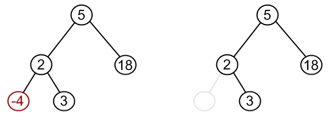

Prepared by Kaveh Kevin Issapour <[kki2101@columbia.edu](kki2101@columbia.edu)> and Linan Qiu <[lq2137@columbia.edu](lq2137@columbia.edu)>

# Binary Search Trees (BST)

In a BST, the left child of a node is always lesser than the node itself. The right node is always greater than the node itself.

This results in a rather convenient result: all nodes to the left of a node (or the left sub-tree of a node) is lesser than the node itself. All nodes to the right of a node (or the right subtree of a node) is greater than the node itself. This is because since the left child of a node is less than the node, so the right child of the left child must still be less than the original node.

## Operations Supported

Being a search tree, the BST should be expected to hold on to elements. Furthermore, we should be able to add elements to it / get elements / remove elements quickly. We also want to know the size and the height of the tree (the level of the deepest node). Let's codify this using an interface:

```java
// AwsmSearchTree.java

public interface AwsmSearchTree<T> {
  public void add(T item);

  public boolean contains(T item);

  public T remove(T item);

  public T get(T item);

  public int size();

  public int height();
}
```

In fact, it should function like a very awesome version of linked list / array list that searches for elements way faster (because it knows, at each step, to get rid of half the tree to search).

## Node

The function used to compare the nodes is usually the `compareTo` method. This has certain implications for the data that we accept in the nodes. First, we need to know that the type `T` is comparable. We can introduce this restriction using the `T extends Comparable<? super T>` pattern that we saw in the generics chapter.

We start with an empty `AwsmBST` class for the binary tree. We can reuse the `AwsmNode` class we came up with in the first note of this chapter. We also make `AwsmNode` an inner class of `AwsmBST`

```java
// AwsmBST.java

public class AwsmBST<T extends Comparable<? super T>> {

  public class AwsmNode<Q extends Comparable<? super Q>> {
    public Q data;
    public AwsmNode<Q> left;
    public AwsmNode<Q> right;

    public AwsmNode(Q data, AwsmNode<Q> left, AwsmNode<Q> right) {
      this.data = data;
      this.left = left;
      this.right = right;
    }

    public String toString() {
      return data.toString();
    }
  }
}
```

## Setting up the BST

Like the previous tree, the BST only needs to hold on to the top most node. Let's call this `root`.

```java
// AwsmBST.java

public class AwsmBST<T extends Comparable<? super T>> implements AwsmSearchTree<T> {

  private AwsmNode<T> root;

  public AwsmBST() {
    root = null;
  }

  @Override
  public void add(T item) {
    // TODO Auto-generated method stub

  }

  @Override
  public boolean contains(T item) {
    // TODO Auto-generated method stub
    return false;
  }

  @Override
  public T remove(T item) {
    // TODO Auto-generated method stub
    return null;
  }

  @Override
  public T get(T item) {
    // TODO Auto-generated method stub
    return null;
  }

  @Override
  public int size() {
    // TODO Auto-generated method stub
    return 0;
  }

  @Override
  public int height() {
    // TODO Auto-generated method stub
    return 0;
  }

  public class AwsmNode<Q extends Comparable<? super Q>> {
    public Q data;
    public AwsmNode<Q> left;
    public AwsmNode<Q> right;

    public AwsmNode(Q data, AwsmNode<Q> left, AwsmNode<Q> right) {
      this.data = data;
      this.left = left;
      this.right = right;
    }

    public String toString() {
      return data.toString();
    }
  }
}
```

Initially, `root` is `null`. We did not initialize it to an empty node. Instead, it is simply `null`. We did this on purpose and you'll see why so in the `add()` function below.

## `toString()`

To make testing easy, we first add a `toString()` method so that we can easily print out the entire tree. This method should be almost the same as the `toString()` for `AwsmTree`, except this time we add a check for `null` nodes (since we start with a `null` `root`).

```java
// AwsmBST.java

public class AwsmBST<T extends Comparable<? super T>> implements AwsmSearchTree<T> {

  private AwsmNode<T> root;
  private int size;

  public AwsmBST() {
    root = null;
    size = 0;
  }

  public String toString() {
    StringBuilder sb = new StringBuilder();
    toString(root, sb, 0);
    return sb.toString();
  }

  private void toString(AwsmNode<T> node, StringBuilder sb, int level) {
    if (node != null) {
      if (node.left != null) {
        toString(node.left, sb, level + 1);
      }

      for (int i = 0; i < level; i++) {
        sb.append("  ");
      }
      sb.append(node);
      sb.append("\n");

      if (node.right != null) {
        toString(node.right, sb, level + 1);
      }
    }
  }

  // interface methods redacted...

  // AwsmNode redacted...
}
```

## `add()`

Adding an element involves making use of the property on the left and right children. Again, we use the public/private method pattern.

```java
// in AwsmBST.java

@Override
public void add(T item) {
  root = add(root, item);
}

private AwsmNode<T> add(AwsmNode<T> node, T item) {
  if (node == null) {
    size++;
    return new AwsmNode<>(item, null, null);
  }

  if (item.compareTo(node.data) < 0) {
    node.left = add(node.left, item);
  } else if (item.compareTo(node.data) > 0) {
    node.right = add(node.right, item);
  } else {
    node.data = item;
  }

  return node;
}
```

The public `add` method takes an item and attempts to add it by calling the private `add` method.

The private `add` method checks if the current node is null. If it is, we have reached a possible position to add a new node. We instantiate a new `AwsmNode`, and assign its `data` the value of `item`. **We return the newly instantiated `AwsmNode`** so that it can be assigned to the parent's `left` or `right`. In the second `if` block, we are checking if the `item` to be added is smaller than or greater than the `data` of the current node. If it is smaller than, we will add the `item` to the left subtree, hence we recurse on `node.left`. The same applies for `node.right`. We will eventually arrive at a null node (since the child of a leaf (a node without any children) is `null`).

If the `item` already exists, we overwrite the `node.data` with `item`.

## `get()`

`get()` functions similarly to `add`. In this case, instead of adding a node, we are trying to find a specific item in the tree.

```java
// in AwsmBST.java

@Override
public T get(T item) {
  AwsmNode<T> getNode = get(root, item);
  return getNode != null ? getNode.data : null;
}

private AwsmNode<T> get(AwsmNode<T> node, T item) {
  if (node == null) {
    return null;
  }

  if (item.compareTo(node.data) < 0) {
    return get(node.left, item);
  } else if (item.compareTo(node.data) > 0) {
    return get(node.right, item);
  } else {
    return node;
  }
}
```

In the public `get()` method, we return an object of type `T`. In the private one, we get the entire `AwsmNode<T>` instead. Hence, the public method basically checks if the returned node is `null`. If it is, return `null`. Otherwise, return the `data` of the node (and not the node itself).

In the private method, we again check if the node is `null`. If it is, we know that we have reached beyond the bottom most layer of the tree and still has not found what want. We give up and return `null`. Otherwise, we check the current `node.data` with `item`. If `item` is less than `node.data`, we check everything to the left of the current node. If `item` is more than, we check the right. Otherwise, when `compareTo` returns 0, we know that we have found what we want. We stop recursing, and return the current `node`.

## `contains()`

Now that we have `get()`, `contains()` is trivial. We simply call the private `get()` for the node that contains the `item`. If `get()` returns us null, we know that the `item` does not exist and hence we return `false`. Otherwise, we return `true`.

This is a one liner:

```java
// in AwsmBST.java

@Override
public boolean contains(T item) {
  return get(root, item) != null;
}
```

## `remove()`

*Images copied from [http://www.algolist.net/Data_structures/Binary_search_tree/Removal](http://www.algolist.net/Data_structures/Binary_search_tree/Removal)*

`remove()` is slightly more involved. We want to remove an `T item` from the tree. That involves removing the node that contains the `item`. We have to consider 3 cases:

### 1. Node to be removed has no children:


\ 

This case is quite simple. We simply make the parent's reference to the node null. For example, in this case, we make the node holding 2's `left` null.

### 2. Node to be removed has one child:


\ 


\ 


\ 

This case is also quite simple. We simply make the parent's reference to the node the node's child. In this case, we make 5's `right` 18 (the node to be removed)'s `right`.

### 3. Node to be removed has two children:

This case is slightly more involved. Let's consider a property of the BST -- all children on the left of a node is less than the node. All children on the right of a node is greater than the node. This means that even the smallest node on the right of a node is larger than the original node. For example,


\ 

Let's say that we are tryin to remove the node containing 12. We note that:

- Whatever node replaces 12 has to be less than the entire right subtree.
- Whatever node replaces 12 has to be greater than the entire left subtree.

In other words, whatever replaces 12, in order to inherit its `left` and `right` nodes, have to be greater than the entire left subtree and less than the entire right subtree.

There's a good candidate for that: the minimum node of the right subtree (i.e. the smallest among the nodes that are greater than 12). An alternative is the maximum node of the left subtree (i.e. the greater amonst the nodes that are smaller than 12). We use the right subtree in our implementation. This node contains 19.


\ 

We replace 12 with 19.


\ 

Then we remove 19 from the tree. In this case, 19 has no children, so it is removed in the first method (by making the parent's reference to it null). If it has a child, we remove it easily as well. It is not possible for the minimum node to have two children (since it has to be the left most leaf).


\ 

Now let's translate this whole procedure into code.

```java
// in AwsmBST.java

@Override
public T remove(T item) {
  AwsmNode<T> removedNode = remove(root, item);
  return removedNode != null ? removedNode.data : null;
}

private AwsmNode<T> remove(AwsmNode<T> node, T item) {
  if (node == null) {
    return null;
  }

  if (item.compareTo(node.data) < 0) {
    node.left = remove(node.left, item);
  } else if (item.compareTo(node.data) > 0) {
    node.right = remove(node.right, item);
  } else {
    // removal
    if (node.left != null && node.right != null) {
      // two children
      node.data = findMin(node.right).data;
      node.right = remove(node.right, node.data);
    } else if (node.left != null) {
      // only left child
      node = node.left;
    } else if (node.right != null) {
      // only right child
      node = node.right;
    } else {
      // no child. remove this element itself.
      // allow null to be propagated to parent's child reference
      // setting that to null
      node = null;
    }
    size--;
  }
  return node;
}

private AwsmNode<T> findMin(AwsmNode<T> node) {
  if (node == null) {
    throw new NoSuchElementException();
  }
  while (node.left != null) {
    node = node.left;
  }
  return node;
}
```

In the public `remove()` method, we return an object of type `T`. Hence, in the private `remove()` method, we get a node, and we check if the node is `null` in the public method similar to what we did `get()`.

In the private method, we check if the `node` is `null`. If so, we return `null`.

Otherwise, we start comparing. If `compareTo` returns a non-0 value, we recurse down the tree. When it returns 0, we know that we have found the node to remove. If the node has two children, we set the `node.data` to the data of the minimum node in the right subtree. We are not done yet! Remember in the visual example above, after replacing 12 with 19, we still have to remove the **original** 19? This is what the line `node.right = remove(node.right, node.data);` is doing.

If the node only has 1 child, we determine which child it is. In the visual example above, we determined that 18 only has a `right` child of 21. Hence, in our code, we return the node containing 21. This would be set to `node.right` in the previous recursion where we called `node.right = remove(node.right, item);` in the `compareTo` `else if`.

If the node has no child, we simply set `node` to `null`. This does not remove the `node`. Instead, it allows us to return a `null` when we call `return node` at the bottom of the method. This `null` gets propagated back to the previous recursion. In our visual example, when we get to -4, we return `null`. This gets set to 2's `left` when we do `node.left = remove(node.left, item);`.

The `findMin` method is a helper method we use to find the minimum node in a subtree. It keeps looking for a left child until it finds the minimum element.

## `size()`

`size` can be implemented by keeping a `size` variable in our `add` and `remove` methods.

```java
// in AwsmBST.java

@Override
public int size() {
  return size;
}
```

## `height()`

`height` can be implemented recursively. Essentially, at each node, the height of the subtree starting from that node is the bigger of the height of either its left subtree or its right subtree **plus one**. Think of it this way: the maximum height I can reach is the height of my shoulders plus the longer of either my left arm or my right arm.

```java
// in AwsmBST.java

@Override
public int height() {
  return height(root, 0);
}

private int height(AwsmNode<T> node, int height) {
  if (node == null) {
    return height;
  }

  int leftHeight = height(node.left, height) + 1;
  int rightHeight = height(node.right, height) + 1;

  return leftHeight > rightHeight ? leftHeight : rightHeight;
}
```

## `iterator()` and `AwsmBSTIterator`

We use pretty much the same iterator for `AwsmTree`. However, we can choose to use **infix** traversal this time, and it would actually give us an ordered print out of the elements in the BST. Why? Because we print out the `left` element first, then the node itself, then the `right` recursively. This obeys the ordering of the elements.

```java
// in AwsmBST.java

@Override
public Iterator<T> iterator() {
  return new AwsmBSTIterator<T>(root);
}

public class AwsmBSTIterator<Q extends Comparable<? super Q>> implements Iterator<Q> {

  private LinkedList<AwsmNode<Q>> list;

  public AwsmBSTIterator(AwsmNode<Q> root) {
    list = new LinkedList<>();
    infixTraverse(root);
  }

  public void infixTraverse(AwsmNode<Q> node) {
    if (node.left != null) {
      infixTraverse(node.left);
    }

    list.add(node);

    if (node.right != null) {
      infixTraverse(node.right);
    }
  }

  @Override
  public boolean hasNext() {
    return !list.isEmpty();
  }

  @Override
  public Q next() {
    return list.removeFirst().data;
  }
}
```

This allows us to do enhanced for loops in order on the BST.

The complete code for `AwsmBST` is available in the folder `AwsmTree`. I also produce it here for good fortune.


```java
// AwsmBST.java

import java.util.Iterator;
import java.util.LinkedList;
import java.util.NoSuchElementException;

public class AwsmBST<T extends Comparable<? super T>> implements AwsmSearchTree<T>, Iterable<T> {

  private AwsmNode<T> root;
  private int size;

  public AwsmBST() {
    root = null;
    size = 0;
  }

  public String toString() {
    StringBuilder sb = new StringBuilder();
    toString(root, sb, 0);
    return sb.toString();
  }

  private void toString(AwsmNode<T> node, StringBuilder sb, int level) {
    if (node != null) {
      if (node.left != null) {
        toString(node.left, sb, level + 1);
      }

      for (int i = 0; i < level; i++) {
        sb.append("  ");
      }
      sb.append(node);
      sb.append("\n");

      if (node.right != null) {
        toString(node.right, sb, level + 1);
      }
    }
  }

  @Override
  public void add(T item) {
    root = add(root, item);
  }

  private AwsmNode<T> add(AwsmNode<T> node, T item) {
    if (node == null) {
      size++;
      return new AwsmNode<>(item, null, null);
    }

    if (item.compareTo(node.data) < 0) {
      node.left = add(node.left, item);
    } else if (item.compareTo(node.data) > 0) {
      node.right = add(node.right, item);
    } else {
      node.data = item;
    }

    return node;
  }

  @Override
  public T get(T item) {
    AwsmNode<T> getNode = get(root, item);
    return getNode != null ? getNode.data : null;
  }

  private AwsmNode<T> get(AwsmNode<T> node, T item) {
    if (node == null) {
      return null;
    }

    if (item.compareTo(node.data) < 0) {
      return get(node.left, item);
    } else if (item.compareTo(node.data) > 0) {
      return get(node.right, item);
    } else {
      return node;
    }
  }

  @Override
  public boolean contains(T item) {
    return get(root, item) != null;
  }

  @Override
  public T remove(T item) {
    AwsmNode<T> removedNode = remove(root, item);
    return removedNode != null ? removedNode.data : null;
  }

  private AwsmNode<T> remove(AwsmNode<T> node, T item) {
    if (node == null) {
      return null;
    }

    if (item.compareTo(node.data) < 0) {
      node.left = remove(node.left, item);
    } else if (item.compareTo(node.data) > 0) {
      node.right = remove(node.right, item);
    } else {
      // removal
      if (node.left != null && node.right != null) {
        // two children
        node.data = findMin(node.right).data;
        node.right = remove(node.right, node.data);
      } else if (node.left != null) {
        // only left child
        node = node.left;
      } else if (node.right != null) {
        // only right child
        node = node.right;
      } else {
        // no child. remove this element itself.
        // allow null to be propagated to parent's child reference
        // setting that to null
        node = null;
      }
      size--;
    }
    return node;
  }

  private AwsmNode<T> findMin(AwsmNode<T> node) {
    if (node == null) {
      throw new NoSuchElementException();
    }
    while (node.left != null) {
      node = node.left;
    }
    return node;
  }

  @Override
  public int size() {
    return size;
  }

  @Override
  public int height() {
    return height(root, 0);
  }

  private int height(AwsmNode<T> node, int height) {
    if (node == null) {
      return height;
    }

    int leftHeight = height(node.left, height) + 1;
    int rightHeight = height(node.right, height) + 1;

    return leftHeight > rightHeight ? leftHeight : rightHeight;
  }

  @Override
  public Iterator<T> iterator() {
    return new AwsmBSTIterator<T>(root);
  }

  public class AwsmNode<Q extends Comparable<? super Q>> {
    public Q data;
    public AwsmNode<Q> left;
    public AwsmNode<Q> right;

    public AwsmNode(Q data, AwsmNode<Q> left, AwsmNode<Q> right) {
      this.data = data;
      this.left = left;
      this.right = right;
    }

    public String toString() {
      return data.toString();
    }
  }

  public class AwsmBSTIterator<Q extends Comparable<? super Q>> implements Iterator<Q> {

    private LinkedList<AwsmNode<Q>> list;

    public AwsmBSTIterator(AwsmNode<Q> root) {
      list = new LinkedList<>();
      infixTraverse(root);
    }

    public void infixTraverse(AwsmNode<Q> node) {
      if (node.left != null) {
        infixTraverse(node.left);
      }

      list.add(node);

      if (node.right != null) {
        infixTraverse(node.right);
      }
    }

    @Override
    public boolean hasNext() {
      return !list.isEmpty();
    }

    @Override
    public Q next() {
      return list.removeFirst().data;
    }
  }
}
```
