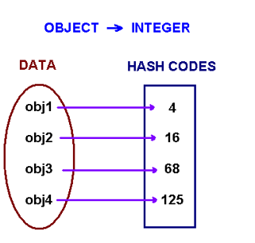
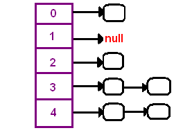

Prepared by Linan Qiu <[lq2137@columbia.edu](lq2137@columbia.edu)>. Adapted almost in entirety from [https://www.cs.cmu.edu/~adamchik/15-121/lectures/Hashing/hashing.html](https://www.cs.cmu.edu/~adamchik/15-121/lectures/Hashing/hashing.html) because I'm running out of time. This is one of the best explanations of hashing I've seen.

# Hashing

## Hashing

The problem at hands is to speed up searching. Consider the problem of searching an array for a given value. If the array is not sorted, the search might require examining each and all elements of the array. If the array is sorted, we can use the binary search, and therefore reduce the worse-case runtime complexity to $O(log n)$. We could search even faster if we know in advance the index at which that value is located in the array. Suppose we do have that magic function that would tell us the index for a given value. With this magic function our search is reduced to just one probe, giving us a constant runtime $O(1)$. Such a function is called a **hash function** . A hash function is a function which when given a key, generates an address in the table.



The example of a hash function is a *book call number*. Each book in the library has a unique call number. A call number is like an address: it tells us where the book is located in the library. Many academic libraries in the United States, uses Library of Congress Classification for call numbers. This system uses a combination of letters and numbers to arrange materials by subjects.

A hash function that returns a unique hash number is called a universal hash function. In practice it is extremely hard to assign unique numbers to objects. The later is always possible only if you know (or approximate) the number of objects to be proccessed.

Thus, we say that our hash function has the following properties

- it always returns a number for an object.
- two equal objects will always have the same number
- two unequal objects not always have different numbers

The precedure of storing objets using a hash function is the following.

Create an array of size $M$. Choose a hash function $h$, that is a mapping from objects into integers $0, 1, ..., M-1$. Put these objects into an array at indexes computed via the hash function $index = h(object)$. Such array is called a **hash table**.


How to choose a hash function? One approach of creating a hash function is to use Java's `hashCode()` method. The `hashCode()` method is implemented in the `Object` class and therefore each class in Java inherits it. The hash code provides a numeric representation of an object (this is somewhat similar to the toString method that gives a text representation of an object). Conside the following code example

```java
Integer obj1 = new Integer(2009);
String obj2 = new String("2009");
System.out.println("hashCode for an integer is " + obj1.hashCode());
// hashCode for an integer is 2009

System.out.println("hashCode for a string is " + obj2.hashCode());
// hashCode for a string is 1537223
```

The method `hasCode` has different implementation in different classes. In the `String` class, `hashCode` is computed by the following formula

$$\texttt{s.charAt(0)} * 31^{n-1} + \texttt{s.charAt(1)} * 31^{n-2} + ... + \texttt{s.charAt(n-1)}$$

where `s` is a string and $n$ is its length. For example, for the string `"ABC"`, we have

$$\texttt{'A'} * 31^2 + \texttt{'B'} * 31 + 'C' = 65 * 31^2 + 66*31 + 67 = 74578$$

Note that Java's hashCode method might return a negative integer. If a string is long enough, its hashcode will be bigger than the largest integer we can store on 64 bits CPU. In this case, due to integer overflow, the value returned by `hashCode` can be negative.

## Collisions

When we put objects into a hashtable, it is possible that different objects (by the `equals()` method) might have the same hashcode. This is called a collision. Here is the example of collision. Two different strings ""Aa" and "BB" have the same key:

$$\texttt{"Aa"} = \texttt{'A'} * 31 + \texttt{'a'} = 2112$$

$$\texttt{"BB"} = \texttt{'B'} * 31 + \texttt{'B'} = 2112$$



How to resolve collisions? Where do we put the second and subsequent values that hash to this same location? There are several approaches in dealing with collisions. One of them is based on idea of putting the keys that collide in a linked list! A hash table then is an array of lists!! This technique is called a **separate chaining collision** resolution.

The big attraction of using a hash table is a constant-time performance for the basic operations add, remove, contains, size. Though, because of collisions, we cannot guarantee the constant runtime in the worst-case. Why? Imagine that all our objects collide into the same index. Then searching for one of them will be equivalent to searching in a list, that takes a linear runtime. However, we can guarantee an expected constant runtime, if we make sure that our lists won't become too long. This is usually implemnted by maintaining a load factor that keeps a track of the average length of lists. If a load factor approaches a set in advanced threshold, we create a bigger array and rehash all elements from the old table into the new one.

Another technique of collision resolution is a linear probing. If we cannot insert at index $k$, we try the next slot $k+1$. If that one is occupied, we go to $k+2$, and so on. This is quite simple approach but it requires new thinking about hash tables. Do you always find an empty slot? What do you do when you reach the end of the table?

We can use hashing to help us create really fast maps.
